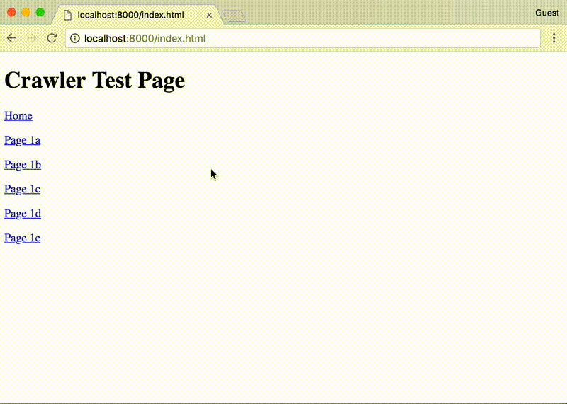
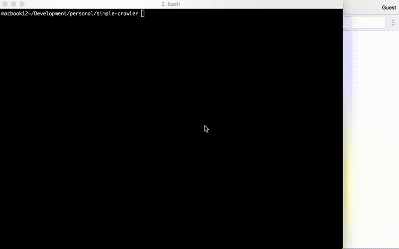

# Simple Web Crawler

Simple web crawler takes a URL as a parameter and creates a tree of child pages linked to the URL. It provides a deep crawl going through multiple levels in the link hierarchy.

Provide a URL as a parameter and the application will return a json representing the site containing the following fields;

    -url
    -title
    -nodes
       

## Features

    - spring security for access (login: admin/password)
    - sync job for crawling (for comparison)
    - async (deferred) jobs for crawling
    - rest command to start crawl
    - unit tests

## Future Enhancements
    
    - Provide 2 rest api points
        - One to start the crawl job (long running thread)
        - Another to check job status and return result
    
    - Or 1 rest api to start the job if not already running, otherwise return status of current running job. Return results only if job completed.
    

## Instructions

start the application from the terminal
~~~
mvn spring-boot:run
~~~
then point your browser at
~~~
http://localhost:8081/crawl-deferred?url=http://[WEBSITE]&depth=[MAXDEPTH]
~~~
where
WEBSITE is the url you wish to crawl
MAXDEPTH is the maximum depth to crawl

~~~
e.g 
http://localhost:8081/crawl-deferred?url=http://nytimes.com&depth=3
http://localhost:8081/crawl-deferred?url=http://localhost:8000&depth=2
~~~
You will be prompted to enter a username and password. Provide the following:
~~~
admin/password
~~~
The site will be crawled and a representation json will be displayed

### Demonstration of crawling supplied Test Pages

    
### Demonstration of packaged Test Pages

### Demonstration of crawling New York Time website at depth = 2

            
    
## Testing

A test site is provided in the resources directory with the following structure

~~~
Home
Page 1a
    Home
    Page 2a
        Home
        Page 3a
        Page 3b
        Page 3c
Page 1b
    Home
    Page 2b
        Home
        Page 3a
        Page 3b
        Page 3c
Page 1c
    Home
    Page 2c
        Home
        Page 3a
        Page 3b
        Page 3c
Page 1d
    Home
    Page 2d
        Home
        Page 3a
        Page 3b
        Page 3c
Page 1e
    Home
    Page 2e
        Home
        Page 3a
        Page 3b
        Page 3c
~~~